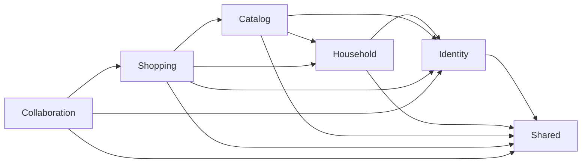
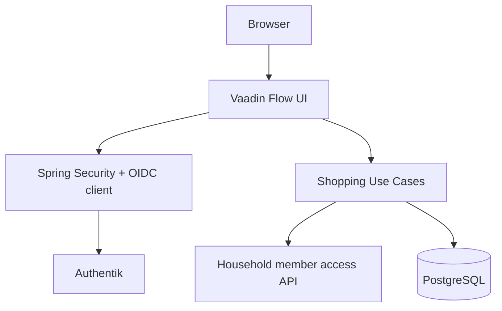
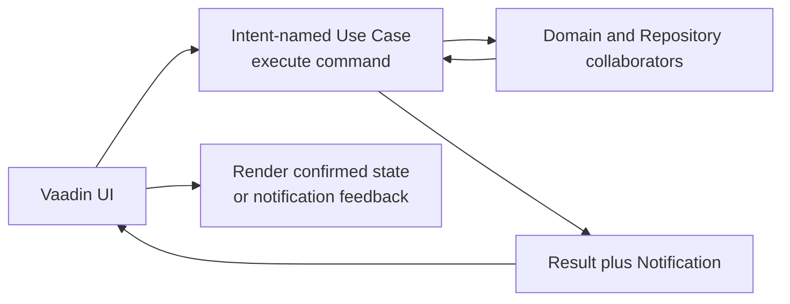
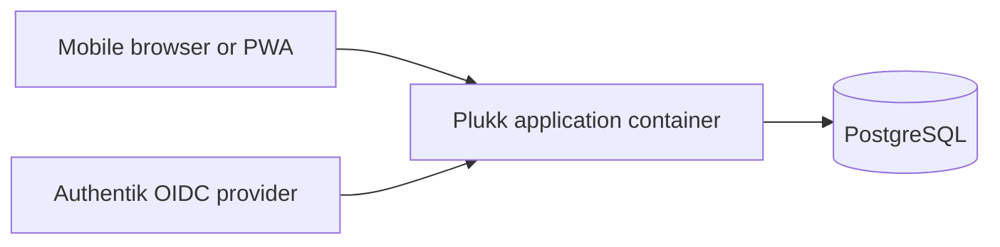

# Architecture

Plukk is a modular monolith built with Spring Boot, Vaadin Flow, PostgreSQL, and Spring Modulith.
One deployment serves one household.

## Module Boundaries

- `identity`: authentication integration and active-member resolution.
- `household`: household-scoped ownership concepts.
- `catalog`: fixed categories and reusable products.
- `shopping`: lists, items, parsing, and shopping workflows.
- `collaboration`: confirmed shared-list event publication and connectivity feedback.
- `shared`: concrete cross-cutting UI and infrastructure utilities only.

## Authentication Boundary

Authenticated requests enter through Spring Security and Vaadin Flow. Application behavior uses the
identity-module API to resolve the current active household member before reading or mutating
household data.

## Use-Case Application Layer

Application orchestration lives in intent-named `*UseCase` classes. Every Use Case exposes one
public `execute(...)` operation. The existing shopping actions are split by intent, including list
creation, rename, open, deletion, need entry, custom-product creation, and focused read actions.
Repositories, member access, security configuration, and Vaadin components retain their technical
responsibilities and are not Use Cases.

Expected, user-correctable validation and business-rule outcomes are returned as small result
records containing a `Notification`. A notification contains stable issue codes and messages for
the UI to display. Authentication failures, database faults, violated invariants, and other
unexpected technical failures remain exceptions; Vaadin logs them and uses its safe retry feedback
rather than presenting them as successful outcomes.

## Runtime Topology

The runtime topology stays intentionally small: one application container plus PostgreSQL.
