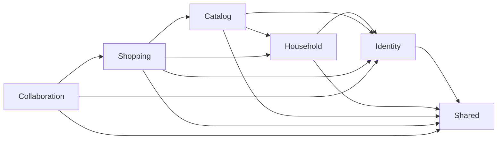
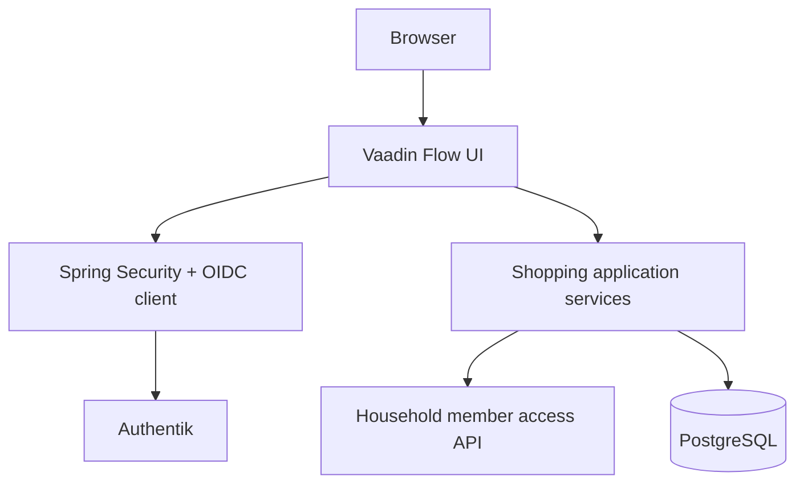
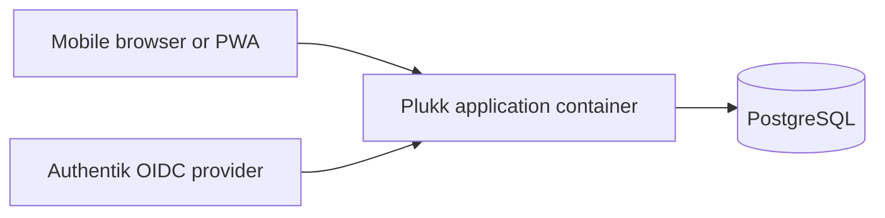

# Architecture

Plukk is a modular monolith built with Spring Boot, Vaadin Flow, PostgreSQL, and Spring Modulith.
One deployment serves one household.

## Module Boundaries

- `identity`: authentication integration and active-member resolution.
- `household`: household-scoped ownership concepts.
- `catalog`: fixed categories and reusable products.
- `shopping`: lists, items, parsing, and shopping workflows.
- `collaboration`: confirmed shared-list event publication and connectivity feedback.
- `shared`: concrete cross-cutting UI and infrastructure utilities only.

## Authentication Boundary

Authenticated requests enter through Spring Security and Vaadin Flow. Application behavior uses the
identity-module API to resolve the current active household member before reading or mutating
household data.

## Runtime Topology

The runtime topology stays intentionally small: one application container plus PostgreSQL.
