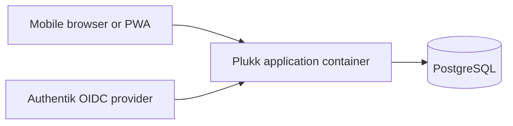

# Architecture

Plukk is a self-hosted, single-household Spring Boot and Vaadin Flow modular monolith with
PostgreSQL. The governing requirements are in the
[constitution](../.specify/memory/constitution.md); these guides explain their implementation.

## Architecture Guides

- [Module boundaries](architecture/module-boundaries.md): Spring Modulith modules, exposed APIs,
  dependency declarations, and module tests.
- [Application layer](architecture/application-layer.md): Use Cases, Notifications, and the UI
  interaction boundary.
- [Testing](architecture/testing.md): behavioral, module, persistence, and end-to-end testing.
- [Persistence](architecture/persistence.md): PostgreSQL, Flyway, and module-owned data.

## Runtime Topology

The runtime remains intentionally small: one application container plus PostgreSQL. Authentik is
an external identity provider rather than application infrastructure.
