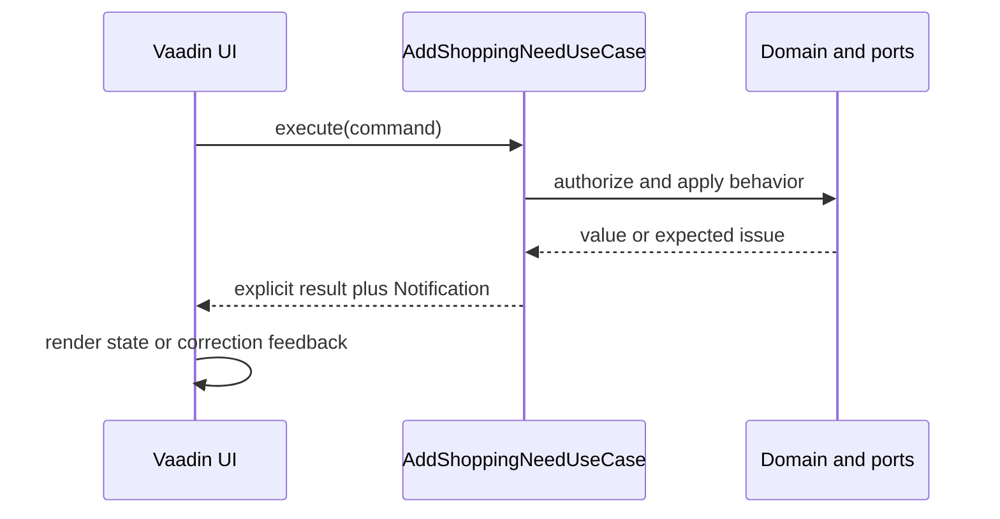

# Application Layer

The constitution requires application orchestration to use intent-named `*UseCase` classes. This
guide explains that boundary without adding a generic application framework.

## Use Cases and Outcomes

A Use Case represents one cohesive application action and has at most one public behavior method,
normally `execute(...)`. It receives commands and ports, coordinates domain behavior,
authorization, transactions, and event publication, and returns a small explicit outcome. Domain
entities retain behavior needed for encapsulation; repositories and adapters keep responsibility-
accurate names rather than being renamed as Use Cases.

Expected user-correctable outcomes use a Notification that collects stable issue codes and
presentation-friendly messages. A result can carry a successful value and a Notification; the UI
chooses how to display issues. Database faults, programming errors, broken invariants, and other
unexpected technical conditions remain exceptions and must not be converted into Notifications.



```java
public record Result(ShoppingList list, Notification notification) {}

public Result execute(CreateCommand command) {
    if (command.name().isBlank()) {
        return new Result(null, Notification.issue("shopping-list.name.required", "A name is required."));
    }
    return new Result(repository.save(ShoppingList.create(command.name())), Notification.success());
}
```

Avoid `BaseUseCase`, `BaseService`, `BaseResult`, and inheritance-based result frameworks. Split a
class with multiple public application actions into cohesive Use Cases instead.

## Boundary Rules

Use Cases depend on domain types and ports, never concrete infrastructure implementations or HTTP,
Vaadin, JPA, or transport return types. Vaadin views call public Use Cases and translate outcomes
into presentation feedback; domain and application code do not depend on Vaadin components or
Authentik-specific types.

Test the public Use Case operation, including Notification outcomes for expected failures and
exceptional technical or invariant failures where relevant.
