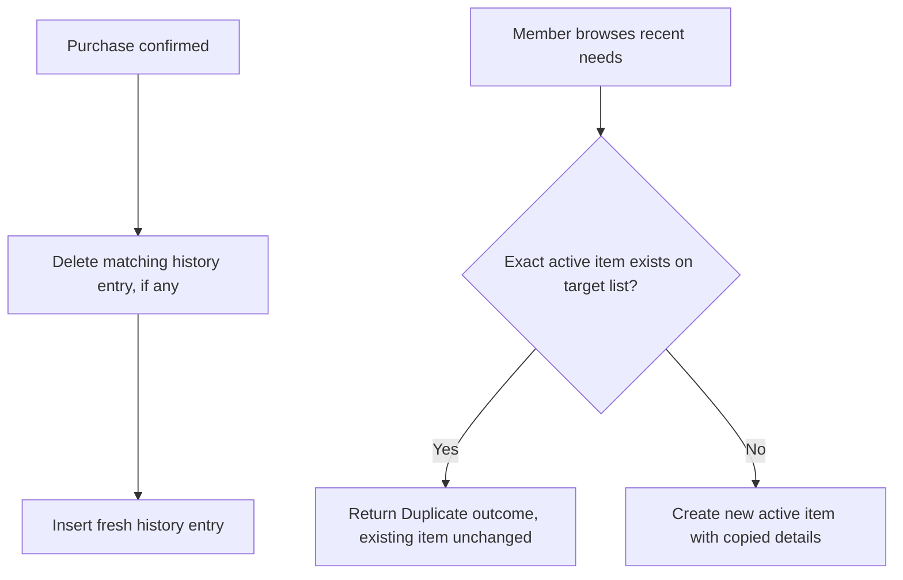

# Catalog and History Reuse

## Catalog Ownership

The catalog module owns `category` and `catalog_product` and is the single source of truth for
product search. `SearchCatalogProductsUseCase` (in the `catalog.api` named interface) matches
active starter and custom products by name and returns each match with its category name and
visual reference so results are discoverable without exposing catalog persistence internals.
Custom products created by any household member are immediately visible to every other member,
since the catalog has no per-member scoping — only household scoping.

## Household-Wide Purchase History

Confirmed purchases are retained as `shopping_history_entry` rows, one per distinct concrete need
(product, variant, quantity, unit, package size, package descriptor) per household. Recording a
purchase deletes any existing entry for that exact combination and inserts a fresh one, so the
entry always sorts as most recently used without ever duplicating history for the same need.
History is household-wide: any authorized member sees every member's recent purchases.

## Re-Adding a Recent Need

`ReAddShoppingNeedUseCase` copies a history entry's concrete details onto the target list using the
same exact-active-item duplicate check as free-text input. If an identical item is already active
on the list, the existing item is returned as a `Duplicate` outcome instead of creating a second
row; otherwise a new active item is created with the copied variant, quantity, unit, package size,
and package descriptor.

