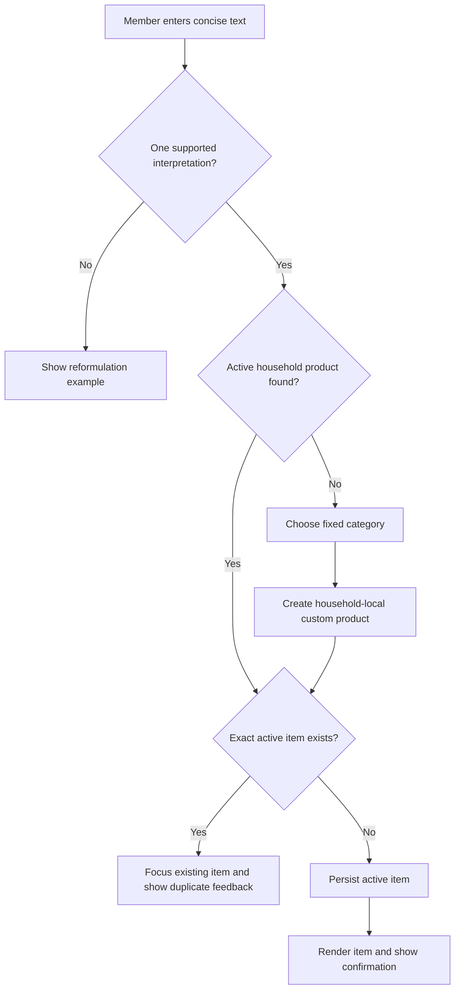

# Shopping Input

Members add one concrete shopping need from the list detail view. The application accepts one
supported interpretation at a time and confirms an item only after PostgreSQL has stored it.

## Supported Grammar

| Input | Stored concrete need |
| --- | --- |
| `kipfilet 400g` | Product `Kip`, variant `Kipfilet`, quantity `400 gram` |
| `melk 2x1l` | Product `Melk`, quantity `2`, package size `1 liter` |
| `appels 6` | Product `Appels`, quantity `6` without a unit |
| `water 6x1.5l` | Product `Water`, quantity `6`, package size `1.5 liter` |
| `cola 2 flessen` | Product `Cola`, quantity `2`, package descriptor `flessen` |

Ambiguous input, such as `melk 2 3l`, and unsupported text do not create an item. The member is
shown `Use one quantity, for example: melk 2x1l.` so they can reformulate safely.

If no active household catalog product matches the interpreted product, the member chooses one of
the fixed household categories in the custom-product dialog. The product is then stored as a
household-local `CUSTOM` catalog product and the concrete item is added.

An exact active-item match uses the persisted product, variant, quantity, unit, package size,
package unit, and package descriptor identity. The existing item remains unchanged, receives
focus, and the member receives duplicate feedback instead of a second item.

