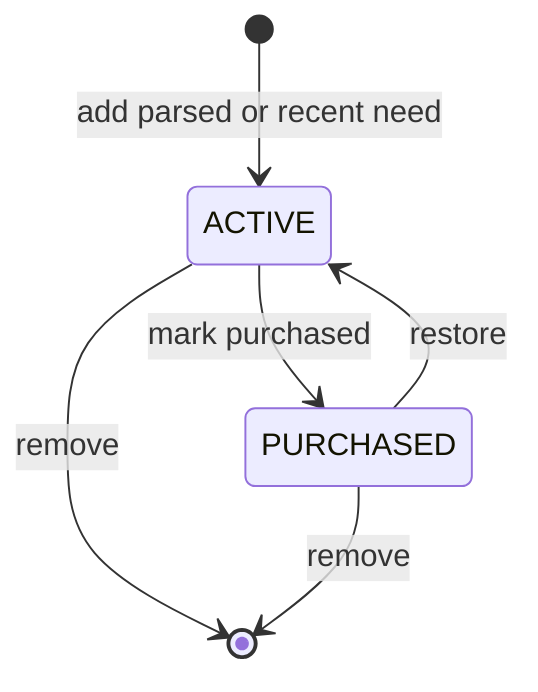

# Shopping Items

## Grouped Display

Shopping list items are read grouped by category in category display order (the same fixed order
used for starter categories). Within a category, active items are listed before purchased items so
the list stays easy to scan during a trip.

## State Transitions

Items are reversible: marking an item purchased keeps it visible in a distinct purchased state, and
restoring a purchased item returns it to active. Removing an item deletes it outright; removing or
restoring a missing item returns a Notification rather than throwing.

## Duplicate Protection on Restore

The active-item uniqueness constraint (list, product, variant, quantity, unit, package size,
package descriptor) still applies when a purchased item is restored. If an identical item is
already active, restoring the purchased one is rejected with a `shopping-item.duplicate`
Notification instead of creating a second active row.

## Ownership

Item mutations (`GetShoppingListSectionsUseCase`, `PurchaseShoppingItemUseCase`,
`RestoreShoppingItemUseCase`, `RemoveShoppingItemUseCase`) require an active `OWNER` or `MEMBER`
household user and re-validate that the target list belongs to that household through
`OpenShoppingListUseCase` before touching any item. Grouping joins the shopping-owned
`shopping_item` table with the catalog-owned `catalog_product` and `category` tables for display
purposes only; category and product ownership remain with the catalog module.
