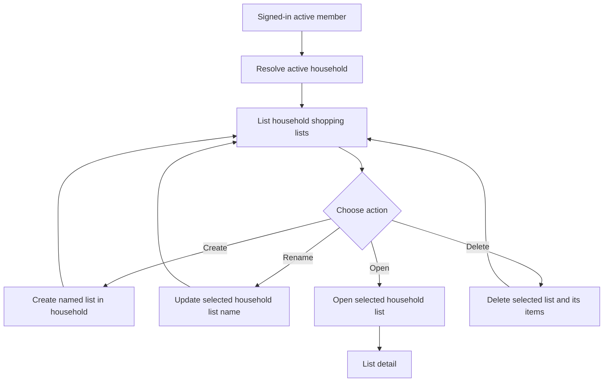

# Shopping Lists

## Ownership

Every shopping list belongs to one household. An active `MEMBER` is resolved from the authenticated
subject before a list is created, listed, opened, renamed, or deleted. Repository queries always
scope a list identifier to that household, so a list from another household is treated as absent.

## Deletion

Deleting a list removes only that list. PostgreSQL cascades the deletion to its shopping items;
catalog products and shopping history remain household data and are not removed. A deletion for a
list outside the member's household is rejected as not found.

## Member Flow

