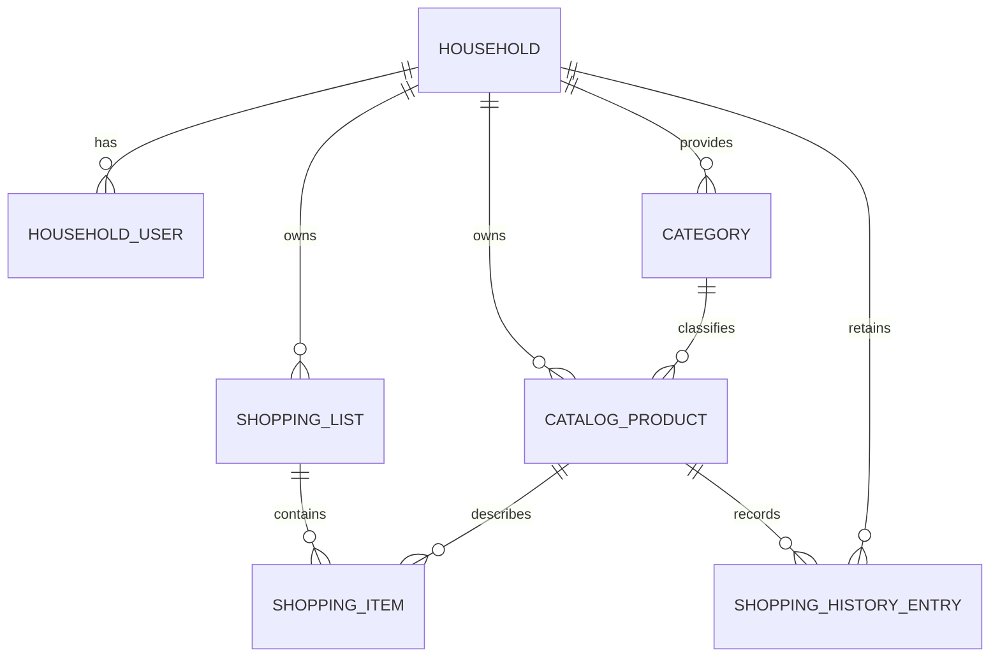
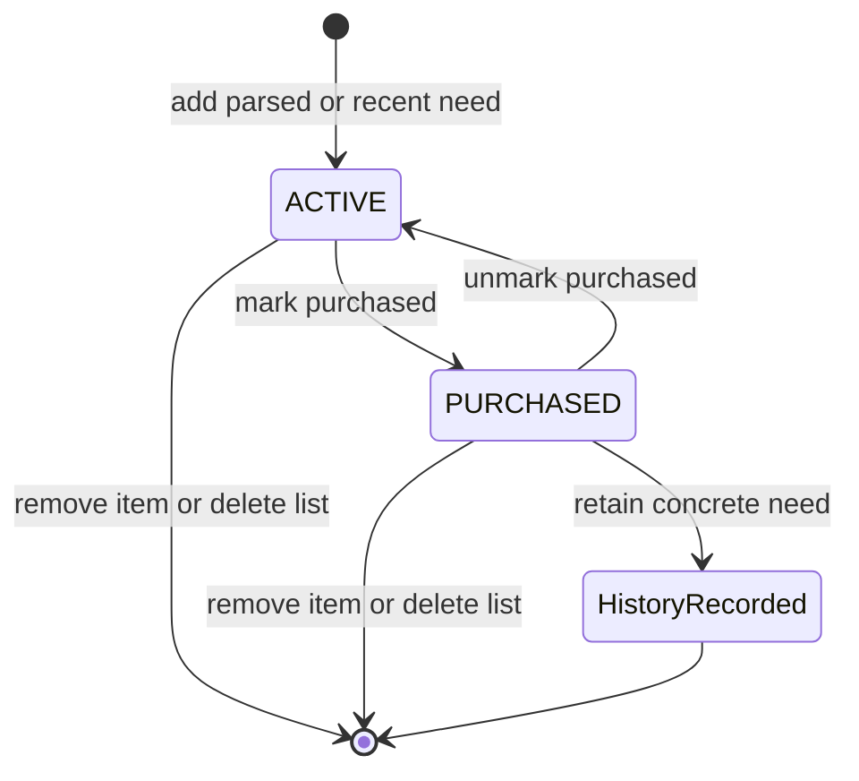

# Data Model: Initial Shopping List

## Relationship Overview

## Persistence Ownership

| Module | Owned tables | Flyway location | Required integration evidence |
|---|---|---|---|
| `household` | `household`, `household_member` | `db/migration/household` | PostgreSQL authorization and role-resolution behavior |
| `catalog` | `category`, `catalog_product` | `db/migration/catalog` | PostgreSQL seeded-category and household-product behavior |
| `shopping` | `shopping_list`, `shopping_item`, `shopping_history_entry` | `db/migration/shopping` | PostgreSQL list, item, duplicate, and household-history behavior |

`identity` and `collaboration` own no persistent business tables in this release. The existing
fresh-install baseline must be replaced before release with these module-owned locations and no
cross-module foreign keys; cross-capability access uses named APIs or confirmed domain events.

## Entities

### Household

- **Purpose**: The single household represented by the deployment.
- **Fields**: identifier; display name; creation timestamp.
- **Rules**: Exactly one household exists. All lists, products, history, and membership belong to it.

### Household User

- **Purpose**: Maps an authenticated external identity to household access.
- **Fields**: identifier; stable external subject; display name; role; active status; timestamps.
- **Rules**: External subject is unique in the household. First release authorizes active `OWNER`
  and `MEMBER` users. `GUEST` is a retained role but cannot access shopping lists; guest workflows
  are not delivered.

### Category

- **Purpose**: A fixed starter grouping for products and list display.
- **Fields**: identifier; stable key; display name; display order.
- **Rules**: Categories are seeded and members cannot create, rename, or delete them. Every catalog
  product has one category.

### Catalog Product

- **Purpose**: A reusable general product, such as `Kip`.
- **Fields**: identifier; name; normalized search name; category; visual reference; origin
  (`STARTER` or `CUSTOM`); active status; timestamps.
- **Rules**: Names are searchable case-insensitively. Custom products are local to the household.
  Products hold no list-specific quantity or variant.

### Shopping List

- **Purpose**: A named collection of household shopping needs.
- **Fields**: identifier; name; timestamps; latest confirmed change sequence.
- **Rules**: Name is required. Deleting a list deletes its items but not catalog products or history.

### Shopping Item

- **Purpose**: A concrete need, such as `Kipfilet - 400 g`, on one shopping list.
- **Fields**: identifier; list; catalog product; variant; quantity; unit; package size; package
  descriptor; state (`ACTIVE` or `PURCHASED`); latest confirmed change sequence; timestamps.
- **Rules**: An active-item uniqueness key uses list, product, normalized variant, quantity, unit,
  package size, and package descriptor. An exact active match is focused, not changed. Purchased
  items remain visible and can return to `ACTIVE`. The latest confirmed concurrent change wins.

### Shopping History Entry

- **Purpose**: Preserves a purchased concrete need for fast re-addition.
- **Fields**: identifier; household; catalog product; copied variant, quantity, unit, package size,
  package descriptor; purchased timestamp.
- **Rules**: Purchasing creates or refreshes an entry visible to all authorized household users.
  Re-adding copies the concrete details unless an exact active item already exists.

## State Transitions

## Validation Rules

- Shopping-list and catalog-product names cannot be blank.
- A catalog product always has one fixed starter category.
- Quantity and package-size values are positive when supplied.
- A parser result is accepted only when exactly one supported interpretation exists.
- Only active `OWNER` and `MEMBER` users can read or change household shopping data; `GUEST` users
  cannot access shopping lists in this release.
- Only post-persistence confirmed item state is published to collaborating users.
