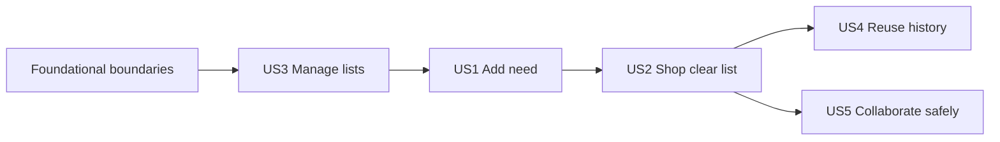

---

description: "Actionable task list for the Initial Shopping List feature"
---

# Tasks: Initial Shopping List

**Input**: Design documents from `/specs/001-initial-shopping-list/`

**Prerequisites**: [plan.md](./plan.md), [spec.md](./spec.md), [research.md](./research.md),
[data-model.md](./data-model.md), [contracts/](./contracts/), and [quickstart.md](./quickstart.md).

**Tests**: Required by the specification and Constitution 1.4.2. Java tests use JUnit, AssertJ,
Given/When/Then structure, and `given<Precondition>_when<Action>_then<ExpectedBehavior>` names.
Use Testcontainers PostgreSQL for each state-owning module, `@ApplicationModuleTest` for exposed
module behavior, and Playwright against the running application for critical mobile journeys.

**Organization**: Tasks are grouped by independently testable user-story slices. The `shopping`
module remains one cohesive capability; `shopping.list`, `shopping.input`, `shopping.item`, and
`shopping.history` are internal packages, not artificial Modulith modules.

## Format: `[ID] [P?] [Story] Description`

- **[P]**: Can run in parallel after its stated prerequisites because it changes different files.
- **[Story]**: Maps the task to a user story from the feature specification.
- Every task includes an exact repository path.

## Phase 1: Setup

**Purpose**: Establish the build and documentation conventions used by every slice.

- [X] T001 Verify stable Java, Spring Boot, Vaadin, Spring Modulith, Testcontainers, and Playwright versions and record the validated baseline in README.md
- [X] T002 [P] Configure the Maven verification lifecycle for JUnit, Testcontainers, Spring Modulith, and Playwright Java in pom.xml
- [X] T003 [P] Document the production Authentik variables and isolated development/test identity profiles in README.md

---

## Phase 2: Foundational Capability Boundaries

**Purpose**: Complete the capability, authorization, persistence, and outcome boundaries that block
all user stories.

**Checkpoint**: `identity` is a stateless authentication adapter; `household`, `catalog`, and
`shopping` own their persistent state and Flyway locations; views call public Use Cases; expected
failures return Notifications.

- [X] T004 Move the fresh-install household and membership schema into the household-owned Flyway location in src/main/resources/db/migration/household/V1__household_and_members.sql
- [X] T005 [P] Move fixed category and starter-product schema and seed data into the catalog-owned Flyway location in src/main/resources/db/migration/catalog/V1__catalog_and_categories.sql
- [X] T006 [P] Move shopping-list, item, active-identity, and history schema into the shopping-owned Flyway location in src/main/resources/db/migration/shopping/V1__shopping_lists_items_and_history.sql
- [X] T007 Remove superseded shared migrations and configure the three module-owned Flyway locations in src/main/resources/db/migration/V1__initial_shopping_schema.sql, src/main/resources/db/migration/V2__seed_categories_and_catalog.sql, and src/main/resources/application.yml
- [X] T008 Define explicit Spring Modulith APIs and allowed dependencies in src/main/java/dev/casteels/plukk/identity/package-info.java, src/main/java/dev/casteels/plukk/household/package-info.java, src/main/java/dev/casteels/plukk/catalog/package-info.java, src/main/java/dev/casteels/plukk/shopping/package-info.java, src/main/java/dev/casteels/plukk/collaboration/package-info.java, and src/main/java/dev/casteels/plukk/shared/package-info.java
- [X] T009 Create the framework-independent authenticated-subject API and keep Spring Security/OIDC extraction inside identity in src/main/java/dev/casteels/plukk/identity/api/AuthenticatedSubject.java and src/main/java/dev/casteels/plukk/identity/DatabaseAuthenticatedSubject.java
- [X] T010 Create the household-owned role-aware authorization API for active OWNER and MEMBER access, with GUEST denial, in src/main/java/dev/casteels/plukk/household/api/AuthorizedHouseholdUser.java and src/main/java/dev/casteels/plukk/household/DatabaseHouseholdAuthorization.java
- [X] T011 Add isolated development and test identity configurations that preserve household authorization and cannot activate in production in src/main/java/dev/casteels/plukk/identity/DevelopmentIdentityConfiguration.java and src/test/resources/application-e2e.yml
- [X] T012 [P] Strengthen module and layer verification for public APIs, forbidden cross-module persistence access, and Use Case-only orchestration in src/test/java/dev/casteels/plukk/architecture/ModulithArchitectureTest.java and src/test/java/dev/casteels/plukk/architecture/UseCaseArchitectureTest.java
- [X] T013 [P] Add PostgreSQL Testcontainers coverage for owned household data and OWNER/MEMBER/GUEST authorization through the household API in src/test/java/dev/casteels/plukk/household/HouseholdAuthorizationIntegrationTest.java
- [X] T014 Make Notification issue codes and successful outcomes the shared contract for expected user-correctable failures in src/main/java/dev/casteels/plukk/shared/notification/Notification.java and src/main/java/dev/casteels/plukk/shared/notification/NotificationIssue.java
- [ ] T015 [P] Verify the production Authentik route, isolated test identity, CSRF protection, and role denial without globally disabling security in src/test/java/dev/casteels/plukk/identity/IdentityAndPersistenceIntegrationTest.java

---

## Phase 3: User Story 3 - Manage Household Shopping Lists (Priority: P1)

**Goal**: Authorized owners and members create, open, rename, and delete household lists through
the `shopping` module’s focused Use Cases.

**Independent Test**: An owner or member creates two lists, receives Notification feedback for a
blank name, renames and opens one, deletes the other, and cannot access a list outside the
household.

### Tests for User Story 3

- [X] T016 [P] [US3] Add focused public-Use-Case tests for create, find, open, rename, delete, and Notification outcomes in src/test/java/dev/casteels/plukk/shopping/list/ShoppingListApplicationTest.java
- [X] T017 [P] [US3] Add PostgreSQL Testcontainers tests for shopping-owned list persistence, household scoping, and deletion behavior in src/test/java/dev/casteels/plukk/shopping/list/ShoppingListPersistenceIntegrationTest.java
- [X] T018 [P] [US3] Add Playwright mobile coverage for owner/member list management and guest denial in src/test/java/dev/casteels/plukk/e2e/ShoppingListManagementE2ETest.java

### Implementation for User Story 3

- [X] T019 [US3] Refactor list Use Cases to depend only on the household authorization API and return explicit Notification-bearing results in src/main/java/dev/casteels/plukk/shopping/list/CreateShoppingListUseCase.java, src/main/java/dev/casteels/plukk/shopping/list/FindShoppingListsUseCase.java, src/main/java/dev/casteels/plukk/shopping/list/OpenShoppingListUseCase.java, src/main/java/dev/casteels/plukk/shopping/list/RenameShoppingListUseCase.java, and src/main/java/dev/casteels/plukk/shopping/list/DeleteShoppingListUseCase.java
- [X] T020 [US3] Keep list domain rules and the shopping-owned persistence adapter internal while exposing only deliberate list result types in src/main/java/dev/casteels/plukk/shopping/list/ShoppingList.java, src/main/java/dev/casteels/plukk/shopping/list/ShoppingListRepository.java, and src/main/java/dev/casteels/plukk/shopping/list/ShoppingListMembership.java
- [X] T021 [US3] Update list views to call public list Use Cases and translate expected failures to Vaadin feedback in src/main/java/dev/casteels/plukk/shopping/ui/ShoppingListsView.java and src/main/java/dev/casteels/plukk/shopping/ui/ShoppingListDetailView.java
- [X] T022 [US3] Update the household-list flow and authorization documentation in docs/domain/shopping-lists.md

**Checkpoint**: List management is a usable, independently tested `shopping` slice with no direct
identity persistence access and no expected validation exceptions.

---

## Phase 4: User Story 1 - Add a Shopping Need Quickly (Priority: P1) 🎯 MVP

**Goal**: An authorized owner or member adds one supported free-text need, creates a household-local
custom product when needed, and receives immediate reformulation or duplicate feedback.

**Independent Test**: An authorized user creates a list, adds `kipfilet 400g` and `melk 2x1l`,
creates a custom product for an unknown product, and receives a Notification without a persisted
item for ambiguous input.

### Tests for User Story 1

- [X] T023 [P] [US1] Extend parser behavior tests for supported quantities, package forms, variants, and reformulation feedback in src/test/java/dev/casteels/plukk/shopping/input/ShoppingInputParserTest.java
- [X] T024 [P] [US1] Add PostgreSQL Testcontainers tests for catalog lookup, custom product creation, active-item uniqueness, and Notification outcomes in src/test/java/dev/casteels/plukk/shopping/input/AddShoppingNeedIntegrationTest.java
- [ ] T025 [P] [US1] Add Playwright mobile coverage for supported add, custom-product creation, duplicate focus, and invalid-input feedback in src/test/java/dev/casteels/plukk/e2e/AddShoppingNeedE2ETest.java

### Implementation for User Story 1

- [X] T026 [US1] Expose catalog category lookup and household product lookup/create APIs without exposing catalog persistence internals in src/main/java/dev/casteels/plukk/catalog/api/CatalogProductAccess.java and src/main/java/dev/casteels/plukk/catalog/api/ShoppingCategoryAccess.java
- [X] T027 [US1] Refactor concise-input parsing and add/custom-product Use Cases to use household and catalog APIs and return Notification-based outcomes in src/main/java/dev/casteels/plukk/shopping/input/ShoppingInputParser.java, src/main/java/dev/casteels/plukk/shopping/input/AddShoppingNeedUseCase.java, src/main/java/dev/casteels/plukk/shopping/input/CreateCustomProductAndAddShoppingNeedUseCase.java, and src/main/java/dev/casteels/plukk/shopping/input/ShoppingNeedOutcome.java
- [X] T028 [US1] Keep concrete-item insertion and exact-active-item detection inside the shopping persistence adapter in src/main/java/dev/casteels/plukk/shopping/input/ShoppingNeedRepository.java
- [ ] T029 [US1] Update the add component and list-detail integration to render confirmation, duplicate, custom-product, and reformulation states from Use Case outcomes in src/main/java/dev/casteels/plukk/shopping/ui/AddShoppingNeedComponent.java and src/main/java/dev/casteels/plukk/shopping/ui/ShoppingListDetailView.java
- [X] T030 [US1] Align the supported-input documentation and behavior contract with Notification outcomes in docs/domain/shopping-input.md and specs/001-initial-shopping-list/contracts/shopping-input.md

**Checkpoint**: The MVP free-text add flow works independently after list management and never
creates an item from an uncertain interpretation.

---

## Phase 5: User Story 2 - Shop From a Clear List (Priority: P1)

**Goal**: Authorized users see category-grouped items and can purchase, restore, or remove an item
while purchased items remain visible until removal.

**Independent Test**: A user sees active items grouped by category, marks one purchased, restores
it, removes it, and receives Notification feedback for a correctable missing-item request.

### Tests for User Story 2

- [ ] T031 [P] [US2] Add public-Use-Case tests for grouped sections, purchase, restore, removal, and Notification outcomes in src/test/java/dev/casteels/plukk/shopping/item/ShoppingItemUseCaseTest.java
- [ ] T032 [P] [US2] Add PostgreSQL Testcontainers tests for reversible item state, category ordering, removal, and household authorization in src/test/java/dev/casteels/plukk/shopping/item/ShoppingItemPersistenceIntegrationTest.java
- [ ] T033 [P] [US2] Add Playwright mobile coverage for grouped active and purchased rendering, purchase, restore, and removal in src/test/java/dev/casteels/plukk/e2e/ShoppingListInteractionE2ETest.java

### Implementation for User Story 2

- [ ] T034 [US2] Implement shopping-owned item domain state and persistence operations for grouped reads and reversible mutations in src/main/java/dev/casteels/plukk/shopping/item/ShoppingItem.java, src/main/java/dev/casteels/plukk/shopping/item/ShoppingItemRepository.java, and src/main/java/dev/casteels/plukk/shopping/item/ShoppingListSection.java
- [ ] T035 [US2] Implement one-operation item Use Cases with Notification-bearing results in src/main/java/dev/casteels/plukk/shopping/item/GetShoppingListSectionsUseCase.java, src/main/java/dev/casteels/plukk/shopping/item/PurchaseShoppingItemUseCase.java, src/main/java/dev/casteels/plukk/shopping/item/RestoreShoppingItemUseCase.java, and src/main/java/dev/casteels/plukk/shopping/item/RemoveShoppingItemUseCase.java
- [ ] T036 [US2] Render mobile-first category sections, touch targets, purchased state, and Use Case feedback in src/main/java/dev/casteels/plukk/shopping/ui/ShoppingListDetailView.java and src/main/frontend/themes/plukk/styles.css
- [ ] T037 [US2] Document item state transitions and grouped-list behavior in docs/domain/shopping-items.md and specs/001-initial-shopping-list/contracts/ui-behavior.md

**Checkpoint**: The list is practical in a store and item mutations are independently tested
behavior rather than UI-side state changes.

---

## Phase 6: User Story 4 - Reuse Products and Recent Needs (Priority: P2)

**Goal**: Authorized users search the household catalog and re-add household-wide recent concrete
needs with copied details.

**Independent Test**: One authorized user purchases `Kipfilet - 400 g`; another finds it in recent
needs and re-adds the same variant, quantity, and unit without duplicate active-item creation.

### Tests for User Story 4

- [ ] T038 [P] [US4] Add public-Use-Case tests for catalog search, household-wide recent lookup, copied details, and duplicate Notification outcomes in src/test/java/dev/casteels/plukk/shopping/history/ShoppingHistoryUseCaseTest.java
- [ ] T039 [P] [US4] Add PostgreSQL Testcontainers tests for catalog visibility, household-wide history, and re-add persistence in src/test/java/dev/casteels/plukk/shopping/history/ShoppingHistoryIntegrationTest.java
- [ ] T040 [P] [US4] Add Playwright mobile coverage for catalog search and cross-member recent-need re-addition in src/test/java/dev/casteels/plukk/e2e/ReuseRecentNeedE2ETest.java

### Implementation for User Story 4

- [ ] T041 [US4] Implement catalog search as a public catalog Use Case using catalog-owned persistence in src/main/java/dev/casteels/plukk/catalog/SearchCatalogProductsUseCase.java and src/main/java/dev/casteels/plukk/catalog/product/CatalogProductRepository.java
- [ ] T042 [US4] Implement household-wide history recording, recent lookup, and re-addition through one-operation shopping Use Cases in src/main/java/dev/casteels/plukk/shopping/history/ShoppingHistoryEntry.java, src/main/java/dev/casteels/plukk/shopping/history/ShoppingHistoryRepository.java, src/main/java/dev/casteels/plukk/shopping/history/ListRecentShoppingNeedsUseCase.java, and src/main/java/dev/casteels/plukk/shopping/history/ReAddShoppingNeedUseCase.java
- [ ] T043 [US4] Record copied concrete details only after a purchase is confirmed in src/main/java/dev/casteels/plukk/shopping/item/PurchaseShoppingItemUseCase.java
- [ ] T044 [US4] Add catalog-search and recent-need UI affordances that translate Use Case outcomes in src/main/java/dev/casteels/plukk/shopping/ui/AddShoppingNeedComponent.java
- [ ] T045 [US4] Document catalog ownership and household-wide history reuse in docs/domain/catalog-and-history.md

**Checkpoint**: Reuse is household-wide, non-predictive, and retains concrete shopping details.

---

## Phase 7: User Story 5 - Collaborate Safely During Shopping (Priority: P2)

**Goal**: Confirmed changes become visible to other active users, reconnection is explicit, and the
latest confirmed same-item change wins without offline mutation support.

**Independent Test**: Two authorized browser sessions observe confirmed changes; an interrupted
write is not shown saved; reconnection refreshes the list; later confirmed same-item mutation wins.

### Tests for User Story 5

- [ ] T046 [P] [US5] Add focused collaboration-module tests proving only confirmed changes publish and later confirmation is authoritative in src/test/java/dev/casteels/plukk/collaboration/SharedListCollaborationModuleTest.java
- [ ] T047 [P] [US5] Add PostgreSQL Testcontainers concurrency tests for ordered same-item confirmations in src/test/java/dev/casteels/plukk/shopping/item/ShoppingItemConcurrencyIntegrationTest.java
- [ ] T048 [P] [US5] Add dual-session Playwright mobile coverage for shared updates, interruption, recovery, and winning state in src/test/java/dev/casteels/plukk/e2e/SharedShoppingListCollaborationE2ETest.java

### Implementation for User Story 5

- [ ] T049 [US5] Publish a shopping public event only after a committed list or item mutation in src/main/java/dev/casteels/plukk/shopping/api/ConfirmedShoppingListChange.java and src/main/java/dev/casteels/plukk/shopping/item/ShoppingItemChangePublisher.java
- [ ] T050 [US5] Implement the stateless collaboration subscriber and confirmed-change delivery boundary without persistent tables in src/main/java/dev/casteels/plukk/collaboration/ConfirmedShoppingListChangeListener.java and src/main/java/dev/casteels/plukk/collaboration/ShoppingListChangeBroadcaster.java
- [ ] T051 [US5] Add monotonic confirmation ordering to shopping item mutations so the latest confirmed write becomes authoritative in src/main/java/dev/casteels/plukk/shopping/item/ShoppingItemRepository.java, src/main/java/dev/casteels/plukk/shopping/item/PurchaseShoppingItemUseCase.java, src/main/java/dev/casteels/plukk/shopping/item/RestoreShoppingItemUseCase.java, and src/main/java/dev/casteels/plukk/shopping/item/RemoveShoppingItemUseCase.java
- [ ] T052 [US5] Render disconnected, confirmation-interrupted, reconnected, and confirmed-refresh states without an offline queue in src/main/java/dev/casteels/plukk/shared/ui/ConnectivityStatusBanner.java and src/main/java/dev/casteels/plukk/shopping/ui/ShoppingListDetailView.java
- [ ] T053 [US5] Document post-commit publication, reconnection, and latest-confirmed-wins behavior in docs/domain/collaboration-and-connectivity.md

**Checkpoint**: Collaboration communicates only durable server-confirmed state and preserves the
explicit no-offline-write boundary.

---

## Phase 8: Polish and Cross-Cutting Verification

**Purpose**: Complete operational documentation and release evidence after all desired slices.

- [ ] T054 [P] Document Authentik production setup, isolated local/test identity, PostgreSQL backup/restore, PWA behavior, and troubleshooting in docs/operations.md
- [ ] T055 [P] Configure CI to run module verification, changed-module tests, PostgreSQL integration tests, and applicable Playwright journeys in .github/workflows/verify.yml
- [ ] T056 [P] Reconcile architecture and domain documentation with final module APIs, migrations, and event boundaries in docs/architecture.md and docs/architecture/module-boundaries.md
- [ ] T057 Run the quickstart scenarios and full Maven verification, then record any required operational corrections in specs/001-initial-shopping-list/quickstart.md
- [ ] T058 Verify every migration has one owner, no cross-module foreign keys remain, all Use Cases expose one public `execute` operation, and the working tree contains no generated or sensitive files in src/main/resources/application.yml and .gitignore

---

## Dependencies and Execution Order

### Phase Dependencies

- **Setup (Phase 1)** has no dependencies.
- **Foundational boundaries (Phase 2)** depend on setup and block all story work.
- **US3** establishes a usable list capability and must precede **US1**, which needs a selected list.
- **US1** supplies concrete items for **US2**.
- **US2** supplies purchase behavior for **US4** and confirmed item mutations for **US5**.
- **US4** and **US5** can proceed in parallel after US2.
- **Polish** depends on all desired stories.

### User Story Dependency Graph



### Parallel Opportunities

- T004-T006 prepare independent migration-owner locations in parallel, then T007 joins them.
- T012-T015 can proceed in parallel after the foundational APIs exist.
- Within each story, test tasks marked `[P]` target separate test files and may proceed in parallel.
- US4 and US5 may be staffed in parallel after US2 is complete.

## Parallel Examples

### User Story 3

```text
Task: "Add list Use Case behavior tests in src/test/java/dev/casteels/plukk/shopping/list/ShoppingListApplicationTest.java"
Task: "Add list PostgreSQL tests in src/test/java/dev/casteels/plukk/shopping/list/ShoppingListPersistenceIntegrationTest.java"
Task: "Add list Playwright coverage in src/test/java/dev/casteels/plukk/e2e/ShoppingListManagementE2ETest.java"
```

### User Story 2

```text
Task: "Add item Use Case tests in src/test/java/dev/casteels/plukk/shopping/item/ShoppingItemUseCaseTest.java"
Task: "Add item PostgreSQL tests in src/test/java/dev/casteels/plukk/shopping/item/ShoppingItemPersistenceIntegrationTest.java"
Task: "Add item Playwright coverage in src/test/java/dev/casteels/plukk/e2e/ShoppingListInteractionE2ETest.java"
```

### User Stories 4 and 5

```text
Task: "Implement household-wide history in src/main/java/dev/casteels/plukk/shopping/history/ShoppingHistoryRepository.java"
Task: "Implement confirmed change delivery in src/main/java/dev/casteels/plukk/collaboration/ShoppingListChangeBroadcaster.java"
```

## Implementation Strategy

### MVP First

1. Complete Phases 1 and 2.
2. Deliver and validate US3, then US1.
3. Stop after US1 and prove list creation plus supported free-text addition on a mobile viewport.

### Incremental Delivery

1. Add US2 to make the list practical during a shopping trip.
2. Add US4 for household-wide reuse after purchase behavior is durable.
3. Add US5 after all mutations have defined confirmed state.
4. Complete cross-cutting verification before release.

## Notes

- Expected validation and business-rule failures return Notification outcomes; unexpected technical
  failures remain exceptions and operator-visible.
- Do not add a separate SPA, offline mutation queue, background-job system, guest invitation flow,
  or cross-module persistence shortcut.
- Each state-owning capability must retain its own migrations, persistence adapter, and PostgreSQL
  integration evidence.
