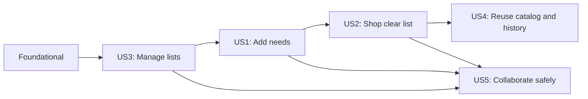

---

description: "Task list for implementing the Initial Shopping List feature"
---

# Tasks: Initial Shopping List

**Input**: Design documents from `/specs/001-initial-shopping-list/`

**Prerequisites**: plan.md, spec.md, research.md, data-model.md, contracts/, and `.specify/memory/constitution.md`

**Tests**: Behavioral tests are mandatory. Java test methods use AssertJ and the naming convention `given<Precondition>_when<Action>_then<ExpectedBehavior>`; tests are written before the corresponding behavior and initially fail.

**Organization**: Tasks are grouped into usable vertical slices. Each slice includes behavior, persistence where needed, UI, automated validation, and audience-focused documentation. The `shared` package is restricted to concrete cross-cutting concerns and MUST NOT contain generic base entities, repositories, services, controllers, or UI abstractions.

## Format: `[ID] [P?] [Story] Description`

- **[P]**: Can run in parallel after its stated dependencies (different files, no dependency on incomplete tasks)
- **[Story]**: User-story slice label (`[US1]` through `[US5]`)
- Every task includes an exact repository path

## Phase 1: Setup and Repository Governance

**Purpose**: Bootstrap the single Maven application, the development toolchain, and the `trunk`-based repository controls that apply to every slice.

- [X] T001 Create the Maven project descriptor with stable Java 25, Spring Boot, Vaadin Flow, Spring Modulith, Flyway, PostgreSQL, Testcontainers, AssertJ, and Playwright Java dependencies in pom.xml
- [X] T002 Create the Spring Boot entry point and package-by-business-capability module skeleton without generic base classes in src/main/java/dev/casteels/plukk/PlukkApplication.java
- [X] T003 [P] Create PostgreSQL, Flyway, Vaadin, PWA, and Authentik OIDC environment-variable placeholders in src/main/resources/application.yml
- [X] T004 [P] Create focused ignore rules for Maven, Vaadin-generated assets, IDE state, Playwright output, test reports, logs, local PostgreSQL data, environment overrides, credentials, and secrets in .gitignore
- [X] T005 [P] Record verified stable technology versions, developer prerequisites, and the project entry-point overview in README.md
- [X] T006 [P] Document Conventional Commits, short-lived branch workflow from `trunk`, rebase-or-squash linear integration, branch deletion, release-tag origin, and a Mermaid `gitGraph` in docs/development-workflow.md
- [X] T007 [P] Add CI validation for Maven verification, Conventional Commit messages and pull-request titles, and a `trunk`-only primary integration workflow in .github/workflows/verify.yml
- [X] T008 [P] Document required `trunk` branch protections, prohibited merge commits and force pushes, required checks, and rebase/squash integration settings in .github/branch-protection.md

---

## Phase 2: Foundational Boundaries

**Purpose**: Establish explicit security, persistence, module, PWA, and architecture foundations without creating a shared dumping ground.

**⚠️ CRITICAL**: Complete this phase before implementation work for a user story. Keep changes small, buildable, and releasable on `trunk` or a short-lived branch rebased onto current `trunk`.

- [X] T009 Create the Flyway baseline schema for household membership, categories, catalog products, shopping lists, shopping items, and shopping history with foreign keys and active-item uniqueness support in src/main/resources/db/migration/V1__initial_shopping_schema.sql
- [X] T010 [P] Seed fixed starter categories and starter catalog products in src/main/resources/db/migration/V2__seed_categories_and_catalog.sql
- [X] T011 [P] Implement Authentik OIDC sign-in, CSRF-safe Vaadin security, and member-only route authorization in src/main/java/dev/casteels/plukk/identity/SecurityConfiguration.java
- [X] T012 [P] Implement authenticated-subject-to-active-household-member resolution as an identity-module API in src/main/java/dev/casteels/plukk/identity/HouseholdMemberAccess.java
- [X] T013 [P] Define Spring Modulith application modules with narrow named API packages and verify allowed dependencies in src/test/java/dev/casteels/plukk/architecture/ModulithArchitectureTest.java
- [X] T014 [P] Implement the application shell, PWA metadata, static offline fallback, and explicit read-only connectivity status without client-side mutation queuing in src/main/java/dev/casteels/plukk/shared/ui/PlukkAppShell.java
- [X] T015 [P] Add PostgreSQL Testcontainers coverage for Flyway migration, active-member access, and rejected unauthenticated access using Given/When/Then test names in src/test/java/dev/casteels/plukk/identity/IdentityAndPersistenceIntegrationTest.java
- [X] T016 [P] Document module responsibilities, allowed dependencies, authentication boundary, and one-container-plus-PostgreSQL topology using focused Mermaid C4 and flowchart diagrams in docs/architecture.md

**Checkpoint**: The application has a secure, migrated PostgreSQL baseline, verified module boundaries, useful PWA fallback, and documented integration governance. No generic `Base*` persistence or service hierarchy has been introduced.

---

## Phase 3: User Story 3 - Manage Household Shopping Lists (Priority: P1) 🎯

**Goal**: Members can create, rename, open, and delete named lists in their household.

**Independent Test**: A signed-in member creates two lists, renames one, opens either, and deletes one while the other remains available.

### Tests for User Story 3

- [X] T017 [P] [US3] Add Given/When/Then application behavior tests for creating, renaming, opening, and deleting household lists in src/test/java/dev/casteels/plukk/shopping/list/ShoppingListApplicationTest.java
- [X] T018 [P] [US3] Add PostgreSQL Testcontainers tests proving a member can manage only their household lists in src/test/java/dev/casteels/plukk/shopping/list/ShoppingListPersistenceIntegrationTest.java
- [X] T019 [P] [US3] Add Playwright mobile-viewport coverage for create, rename, switch, and delete list journeys in src/test/java/dev/casteels/plukk/e2e/ShoppingListManagementE2ETest.java

### Implementation for User Story 3

- [X] T020 [P] [US3] Implement the explicit shopping-list aggregate, repository, and list-local persistence mapping in src/main/java/dev/casteels/plukk/shopping/list/ShoppingList.java
- [X] T021 [US3] Implement member-authorized create, rename, open, and delete list use cases in src/main/java/dev/casteels/plukk/shopping/list/ShoppingListApplicationService.java
- [X] T022 [US3] Implement the mobile-first list overview, create/rename/delete controls, and list selection view in src/main/java/dev/casteels/plukk/shopping/ui/ShoppingListsView.java
- [X] T023 [US3] Document household list ownership, deletion semantics, and the list-management user flow with a Mermaid flowchart in docs/domain/shopping-lists.md

**Checkpoint**: Members can manage multiple household lists through a mobile-friendly, authorized vertical slice. Its tests, documentation, and cohesive Conventional Commit are ready for linear integration into `trunk`.

---

## Phase 4: User Story 1 - Add a Shopping Need Quickly (Priority: P1) 🎯 MVP

**Goal**: Members add a concrete shopping need from concise text, create a missing local product, and receive clear feedback for unsupported input.

**Independent Test**: A signed-in member opens a list, enters `kipfilet 400g` and `melk 2x1l`, sees confirmed active items, creates a missing custom product, and receives reformulation guidance for ambiguous input.

### Tests for User Story 1

- [ ] T024 [P] [US1] Add Given/When/Then parser behavior tests for supported quantities, units, multipliers, packages, ambiguous input, and reformulation feedback in src/test/java/dev/casteels/plukk/shopping/input/ShoppingInputParserTest.java
- [ ] T025 [P] [US1] Add PostgreSQL Testcontainers tests for confirmed item creation, exact-active duplicate focusing, and custom-product fallback in src/test/java/dev/casteels/plukk/shopping/input/AddShoppingNeedIntegrationTest.java
- [ ] T026 [P] [US1] Add Playwright mobile-viewport coverage for supported input, custom-product creation, confirmation-only feedback, and failed parsing in src/test/java/dev/casteels/plukk/e2e/AddShoppingNeedE2ETest.java

### Implementation for User Story 1

- [ ] T027 [P] [US1] Implement explicit catalog product and fixed-category persistence mappings with household-scoped custom products in src/main/java/dev/casteels/plukk/catalog/product/CatalogProduct.java
- [ ] T028 [P] [US1] Implement the concrete shopping-item aggregate, normalized active-item identity, and confirmed add state in src/main/java/dev/casteels/plukk/shopping/item/ShoppingItem.java
- [ ] T029 [US1] Implement one-supported-interpretation parsing and user-safe reformulation results in src/main/java/dev/casteels/plukk/shopping/input/ShoppingInputParser.java
- [ ] T030 [US1] Implement authorized add-need orchestration, persisted duplicate detection that keeps an exact active match unchanged, and local custom-product creation in src/main/java/dev/casteels/plukk/shopping/input/AddShoppingNeedApplicationService.java
- [ ] T031 [US1] Implement the one-handed text-entry interaction and fixed-category custom-product dialog in src/main/java/dev/casteels/plukk/shopping/ui/AddShoppingNeedComponent.java
- [ ] T032 [US1] Integrate confirmation-only add feedback, duplicate-item focus, and safe unexpected-error handling in src/main/java/dev/casteels/plukk/shopping/ui/ShoppingListDetailView.java
- [ ] T033 [US1] Document supported input grammar, accepted examples, custom-product fallback, duplicate behavior, and a Mermaid parse-decision flowchart in docs/domain/shopping-input.md

**Checkpoint**: A member can quickly add reliable, confirmed shopping needs without accidental duplicates or silent interpretation. The slice remains usable with documentation and tests integrated before its cohesive Conventional Commit reaches `trunk`.

---

## Phase 5: User Story 2 - Shop From a Clear List (Priority: P1)

**Goal**: Members recognize active items quickly and purchase, restore, or remove them without losing context.

**Independent Test**: A member opens a populated list, sees category-grouped active items, marks one purchased, restores it, removes another, and verifies purchased items remain visible until removal.

### Tests for User Story 2

- [ ] T034 [P] [US2] Add Given/When/Then behavior tests for category grouping, purchase, restore, remove, and active-item prominence in src/test/java/dev/casteels/plukk/shopping/item/ShoppingItemApplicationTest.java
- [ ] T035 [P] [US2] Add PostgreSQL Testcontainers tests for reversible item state transitions and deletion consistency in src/test/java/dev/casteels/plukk/shopping/item/ShoppingItemPersistenceIntegrationTest.java
- [ ] T036 [P] [US2] Add Playwright mobile-viewport coverage for grouped display, purchase, restore, and remove interactions in src/test/java/dev/casteels/plukk/e2e/ShoppingListInteractionE2ETest.java

### Implementation for User Story 2

- [ ] T037 [US2] Implement member-authorized purchase, restore, remove, and confirmed item-read use cases in src/main/java/dev/casteels/plukk/shopping/item/ShoppingItemApplicationService.java
- [ ] T038 [P] [US2] Implement category-grouped list presentation data that keeps active items visually dominant in src/main/java/dev/casteels/plukk/shopping/ui/ShoppingListSections.java
- [ ] T039 [US2] Implement touch-friendly purchase, restore, remove, and purchased-state rendering in src/main/java/dev/casteels/plukk/shopping/ui/ShoppingListDetailView.java
- [ ] T040 [US2] Document item states, reversibility, category grouping, and a Mermaid state diagram for active and purchased items in docs/domain/shopping-items.md

**Checkpoint**: Shopping trips are supported by a clear, reversible list UI. Tests and domain documentation travel with this slice, ready for linear `trunk` integration.

---

## Phase 6: User Story 4 - Reuse Products and Recent Needs (Priority: P2)

**Goal**: Members search the household catalog and re-add a purchased concrete need without retyping its useful details.

**Independent Test**: A member searches starter and custom products, purchases `Kipfilet - 400 g`, and re-adds it from recent needs with variant, quantity, and unit preserved.

### Tests for User Story 4

- [ ] T041 [P] [US4] Add Given/When/Then behavior tests for starter/custom catalog search, purchase-history refresh, and recent-need re-addition in src/test/java/dev/casteels/plukk/catalog/CatalogReuseApplicationTest.java
- [ ] T042 [P] [US4] Add PostgreSQL Testcontainers tests for household-scoped catalog visibility and copied concrete history details in src/test/java/dev/casteels/plukk/shopping/history/ShoppingHistoryIntegrationTest.java
- [ ] T043 [P] [US4] Add Playwright mobile-viewport coverage for catalog search and recent-need re-addition in src/test/java/dev/casteels/plukk/e2e/ReuseRecentNeedE2ETest.java

### Implementation for User Story 4

- [ ] T044 [P] [US4] Implement the shopping-history entry mapping that copies concrete purchased-item details in src/main/java/dev/casteels/plukk/shopping/history/ShoppingHistoryEntry.java
- [ ] T045 [US4] Implement catalog search, recent-need lookup, and confirmed re-add use cases without predictive suggestions in src/main/java/dev/casteels/plukk/catalog/CatalogReuseApplicationService.java
- [ ] T046 [US4] Record or refresh concrete shopping history only after a confirmed purchase in src/main/java/dev/casteels/plukk/shopping/item/ShoppingItemApplicationService.java
- [ ] T047 [US4] Implement mobile catalog-search and recent-needs affordances in src/main/java/dev/casteels/plukk/shopping/ui/AddShoppingNeedComponent.java
- [ ] T048 [US4] Document catalog visibility, fixed categories, recent-need retention, and a Mermaid sequence diagram for confirmed purchase-to-re-add in docs/domain/catalog-and-history.md

**Checkpoint**: Familiar products and concrete recent needs reduce repeat typing without adding favorites, prediction, or recurring suggestions. Documentation and tests are complete within the slice.

---

## Phase 7: User Story 5 - Collaborate Safely During Shopping (Priority: P2)

**Goal**: Confirmed shared-list changes propagate promptly, connection state is clear, and concurrent same-item changes resolve to the latest confirmed state.

**Independent Test**: Two signed-in members view a list; confirmed changes appear in the other session, interrupted writes are never shown as saved, reconnect refreshes state, and two confirmed same-item changes end in the state from the later confirmation.

### Tests for User Story 5

- [ ] T049 [P] [US5] Add Given/When/Then application tests proving only confirmed mutations publish and later-confirmed same-item mutations replace earlier confirmed state in src/test/java/dev/casteels/plukk/collaboration/SharedListCollaborationApplicationTest.java
- [ ] T050 [P] [US5] Add PostgreSQL Testcontainers concurrency tests that serialize same-item confirmed changes and assert latest-confirmed-wins rather than optimistic-lock rejection or silent loss in src/test/java/dev/casteels/plukk/shopping/item/ShoppingItemConcurrencyIntegrationTest.java
- [ ] T051 [P] [US5] Add Playwright dual-session mobile coverage for add, purchase, restore, remove, update, disconnect, interrupted confirmation, reconnect refresh, and latest-confirmed-wins behavior in src/test/java/dev/casteels/plukk/e2e/SharedShoppingListCollaborationE2ETest.java

### Implementation for User Story 5

- [ ] T052 [P] [US5] Implement confirmed shopping-list change events and household/list-scoped publication channels in src/main/java/dev/casteels/plukk/collaboration/ShoppingListChangePublisher.java
- [ ] T053 [US5] Implement transactional same-item command serialization with a persisted confirmation sequence so every later confirmed mutation becomes authoritative instead of being rejected by optimistic locking in src/main/java/dev/casteels/plukk/shopping/item/ShoppingItemConcurrencyService.java
- [ ] T054 [US5] Publish only post-commit list and item changes from shopping application services in src/main/java/dev/casteels/plukk/shopping/item/ShoppingItemApplicationService.java
- [ ] T055 [US5] Implement explicit disconnected, reconnecting, confirmed, and unresolved-write UI states without offline mutation queues in src/main/java/dev/casteels/plukk/shopping/ui/ConnectivityStatusBanner.java
- [ ] T056 [US5] Refresh open list views from confirmed collaboration events and reconnection recovery in src/main/java/dev/casteels/plukk/shopping/ui/ShoppingListDetailView.java
- [ ] T057 [US5] Document confirmed-event propagation, connectivity states, the latest-confirmed-wins sequence, and Mermaid sequence/state diagrams in docs/domain/collaboration-and-connectivity.md

**Checkpoint**: Collaboration preserves trust: persistence confirmation determines both publication and winning order, with no rejected-later-confirmed write, no silent loss, and no false saved status.

---

## Phase 8: Final Verification and Cross-Slice Hygiene

**Purpose**: Verify the complete release and only genuinely cross-slice material. Documentation is already delivered per slice and is reviewed here for consistency, not deferred creation.

- [ ] T058 [P] Review all Markdown documentation for current setup, architecture, operational guidance, and Mermaid source accuracy in README.md
- [ ] T059 [P] Add Docker Compose, external PostgreSQL, backup/restore, Authentik configuration, Playwright setup, and troubleshooting guidance with a Mermaid deployment diagram in docs/operations.md
- [ ] T060 [P] Add a quality-gate checklist for Given/When/Then names, AssertJ, Testcontainers, Playwright, Modulith verification, documentation, Conventional Commits, and linear `trunk` integration in docs/release-checklist.md
- [ ] T061 Run the full Maven test and verification suite and resolve cross-slice failures in pom.xml
- [ ] T062 Verify the feature branch is rebased on current `trunk`, all commits are cohesive Conventional Commits, the integration is rebase-or-squash only, and the source branch can be deleted after integration in docs/development-workflow.md

---

## Dependencies & Execution Order

### Phase Dependencies

- **Setup (Phase 1)**: Starts immediately and establishes the technology, documentation, and repository rules.
- **Foundational (Phase 2)**: Depends on setup and blocks story implementation.
- **US3 (Phase 3)**: Starts after foundational work and creates the independently usable list-management slice.
- **US1 (Phase 4)**: Depends on US3 because its independent journey requires selecting a list.
- **US2 (Phase 5)**: Depends on US1 because it operates on created shopping items.
- **US4 (Phase 6)**: Depends on US2 because a confirmed purchase produces reusable history.
- **US5 (Phase 7)**: Depends on US1, US2, and US3 because it applies collaboration to confirmed list and item changes.
- **Final verification (Phase 8)**: Depends on the desired story slices; it does not defer slice documentation.

### User Story Dependency Graph



### Within Each User Story

- Write the listed Given/When/Then behavioral tests first and observe their initial failure.
- Implement focused business-module behavior and persistence, not broad shared-layer abstractions.
- Connect behavior to the Vaadin UI, then pass the listed integration and mobile end-to-end tests.
- Update the slice documentation and Mermaid source with the behavior before creating a cohesive Conventional Commit.
- Keep the branch short-lived and current with `trunk`; integrate linearly by rebase-and-merge or squash-and-merge, never a merge commit.

## Parallel Opportunities

- `T003` through `T008` can proceed in parallel after `T001` and `T002`.
- `T010` through `T016` can proceed in parallel after `T009`, except where code naturally consumes another module's API.
- In **US3**, `T017` through `T020` can proceed in parallel before the application service and UI integration.
- In **US1**, `T024` through `T028` can proceed in parallel before parsing and orchestration integrate them.
- In **US2**, `T034` through `T036` and `T038` can proceed in parallel before detail-view integration.
- In **US4**, `T041` through `T044` can proceed in parallel before confirmed history recording and UI integration.
- In **US5**, `T049` through `T052` can proceed in parallel before transaction, publication, and view wiring converge.

## Parallel Example: User Story 5

```text
Task: "Add Given/When/Then application tests in src/test/java/dev/casteels/plukk/collaboration/SharedListCollaborationApplicationTest.java"
Task: "Add PostgreSQL concurrency tests in src/test/java/dev/casteels/plukk/shopping/item/ShoppingItemConcurrencyIntegrationTest.java"
Task: "Add dual-session mobile coverage in src/test/java/dev/casteels/plukk/e2e/SharedShoppingListCollaborationE2ETest.java"
Task: "Implement confirmed change publication channels in src/main/java/dev/casteels/plukk/collaboration/ShoppingListChangePublisher.java"
```

## Implementation Strategy

### MVP First

1. Complete Setup and Foundational phases, including the `trunk` workflow and architecture diagrams.
2. Deliver US3 with its tests and list-management documentation as a small, linear `trunk` increment.
3. Deliver US1 with parser, persistence, mobile behavior, and shopping-input documentation.
4. Validate list management plus confirmed, duplicate-safe fast item addition as the smallest coherent MVP.

### Incremental Delivery

1. US3 establishes secure household list management.
2. US1 makes a selected list useful through fast, reliable addition.
3. US2 supports shopping trips with reversible, clear item states.
4. US4 reduces repeat entry through catalog search and recent needs.
5. US5 adds trusted shared updates and degraded-connectivity behavior, preserving latest-confirmed-wins.

### Suggested MVP Scope

The smallest coherent MVP is **Phase 1 + Phase 2 + US3 + US1**. The work remains split into cohesive, independently testable vertical-slice commits integrated linearly into `trunk`.

## Notes

- All task lines use the required checkbox, sequential ID, optional `[P]`, story label for story work, and exact path format.
- Task-level documentation is deliberately embedded in every user-story slice; Phase 8 checks consistency and operations rather than creating the missing product documentation.
- The concurrency implementation is explicitly required to serialize or otherwise order confirmed same-item mutations. Optimistic locking is acceptable only if it transparently retries/reapplies so the latest confirmed mutation succeeds and wins; rejection or silently discarding the later confirmed change violates FR-015.
